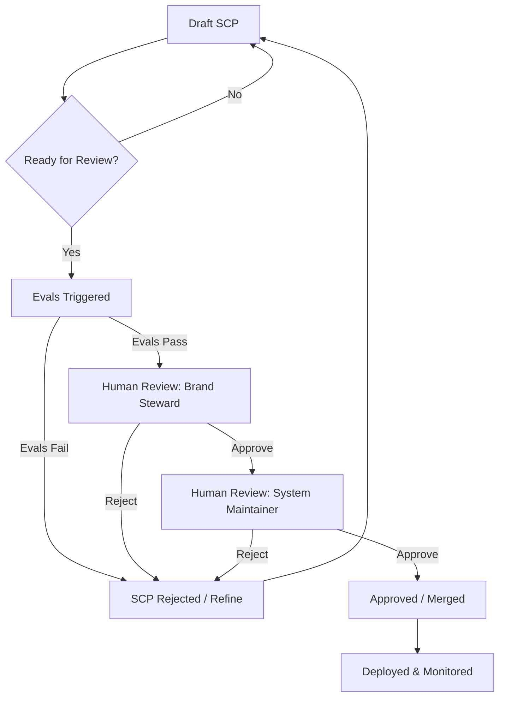

# Experience Systems: A Unified Blueprint for Cross-Media Creative Direction

**Version 4.0 — Unified Architecture, Detailed Governance, and Refined Positioning**

---

## Abstract

Traditional design systems, while mature in UI consistency, are fundamentally insufficient for the generative AI era. The industry's nascent "AI-ready" efforts are promising but remain UI-centric, leaving critical gaps in ensuring brand coherence across the exploding landscape of media types.

**Experience Systems (ES)** bridge this chasm. An ES is a machine-executable package of brand identity, embodying semantic creative direction through explicit schemas, derivation rules, and multi-modal generative adapters. It ensures that a brand's essence translates cohesively across web interfaces, video content, audio identity, spatial experiences, and beyond.

This document presents a unified, comprehensive blueprint for Experience Systems. It synthesizes the strategic vision with a detailed, implementation-first architecture, pragmatic rollout, and robust governance framework, delivering a truly buildable and governable paradigm for the future of brand expression.

---

## Part I: The Industry Context & Strategic Imperative

### 1.1 The Evolution of Design Systems and the Emerging Gap

Design systems have revolutionized UI development, bringing consistency and efficiency through atomic tokens, multi-framework component libraries (e.g., Material, Carbon, Polaris), and evolving tokenization standards. The industry is now embracing "AI-ready" principles, recognizing that explicit, machine-readable design decisions are crucial for AI integration (as championed by Supernova and reflected in generative pipelines like frog's).

However, current advancements, while significant, remain predominantly UI-focused. This leaves a critical gap: **maintaining semantic brand coherence across diverse media beyond pixels and components.** No existing system ensures that a brand's "energetic" personality feels energetic in UI interactions *and* video pacing *and* audio tempo *and* voice delivery.

### 1.2 The Strategic Imperative: Why Now?

Three converging forces make Experience Systems not just possible, but imperative:

*   **Generative AI Maturity**: Advanced models (Midjourney, Sora, Suno, ElevenLabs) now produce production-quality content across modalities and respond to parametric control, but lack inherent brand understanding.
*   **Semantic Token Standards**: Evolving standards provide the foundation for machine-readable creative direction.
*   **AI Agents as Collaborators**: Platforms like Claude Skills enable AI to directly integrate with and leverage codified system knowledge.

This convergence creates a bottleneck: creative teams cannot scale to meet demand for multi-platform, multi-modal content while ensuring brand integrity. Manual reviews are slow and unscalable. Experience Systems automate brand coherence, transforming the creative workflow.

### 1.3 The Unique Value Proposition of Experience Systems

Experience Systems uniquely provide:

| Feature                                | Traditional Design Systems (UI-centric)         | AI-Ready DS (UI-centric)                    | Experience Systems (Multi-modal)                    |
| :------------------------------------- | :---------------------------------------------- | :------------------------------------------ | :-------------------------------------------------- |
| **Scope of Coherence**                 | Visual UI consistency                           | UI component generation, code alignment     | **Cross-Media Semantic Coherence** (UI, video, audio, 3D, voice) |
| **Creative Direction**                 | Human-readable guidelines, component specs      | Machine-readable UI tokens                  | **Executable Brand Guidelines** (deterministic code for all media) |
| **Generative Capabilities**            | Manual component creation                       | AI-assisted UI component generation         | **Multi-Modal Generative Adapters** (for Midjourney, Sora, Suno, ElevenLabs) |
| **Quality Assurance**                  | Manual design reviews, linting                  | Automated UI-level checks                   | **Automated Brand Evaluation** (across all outputs, measurable coherence) |
| **Evolution Mechanism**                | Periodic redesigns                              | Some usage telemetry for UI                 | **Data-Informed Evolution** (continuous, measured improvement) |

---

## Part II: The Unified Architecture of an Experience System

An ES is a version-controlled, machine-executable package of brand identity. It consists of seven tightly integrated layers, explicitly defined through structured schemas.

### Layer 1: ES Manifest (`es-package.json`)

The system's identity, capabilities, and foundational governance settings.

```json
{
  "name": "@brand/experience-system",
  "version": "4.0.0",
  "description": "Unified creative direction for Brand X.",
  "owner": "brand-systems-team",
  "schemaVersion": "1.0",
  "capabilities": {
    "mediaTypes": ["ui", "video-stills", "social-graphics", "short-form-video", "background-audio", "voiceover"],
    "platforms": ["web", "ios", "android"],
    "supportedAgents": ["claude-3.5-sonnet", "gpt-4"]
  },
  "governance": {
    "humanReviewRequired": true,
    "driftThreshold": 0.15,
    "immutableCore": ["semantic.brand-essence", "personality.primary"],
    "changeApprovalWorkflow": "state-based-process-v1"
  }
}
```

### Layer 2: Creative Direction (`creative-direction.json`)

Codifies the brand's abstract personality and language into machine-readable vectors and qualitative rules.

```json
{
  "brandPersonality": {
    "primary": {
      "energy": 0.6, "warmth": 0.7, "sophistication": 0.8, "playfulness": 0.2
    },
    "emotionalRange": ["confident", "approachable", "innovative"],
    "avoid": ["aggressive", "childish", "corporate-cold"]
  },
  "visualLanguage": {
    "geometry": "rounded-geometric",
    "density": "spacious",
    "hierarchy": "clear-pronounced",
    "imageStyle": "warm-natural-lighting, authentic-moments"
  },
  "motionLanguage": {
    "pacing": "measured-deliberate",
    "easing": "ease-out-cubic",
    "personality": "purposeful-smooth",
    "avoid": ["bounce", "elastic"]
  },
  "voiceTone": {
    "style": "professional, warm, clear",
    "vocabulary": {"prefer": ["innovate", "empower"], "avoid": ["disrupt", "synergy"]},
    "pacing": "medium"
  }
}
```

### Layer 3: Semantic Tokens & Derivation Rules (`tokens-and-rules.json`)

Contains **seed tokens** (foundational, atomic values) and **derivation rules** that programmatically generate the full, rich semantic token library. This layer makes the system generative, ensuring consistency from minimal inputs.

```json
{
  "seeds": {
    "color": { "primary": "oklch(0.5 0.18 250)" },
    "typography": { "baseFontSize": "16px", "scaleRatio": 1.25 },
    "spacing": { "baseUnit": "4px" },
    "motion": { "baseDuration": "200ms" }
  },
  "rules": {
    "color-palette": {
      "from": "seeds.color.primary",
      "generate": [
        {"name": "primary-scale", "method": "oklch-lightness-scale", "steps": 9, "range": [0.95, 0.2]},
        {"name": "secondary", "method": "analogous-hue-shift", "degrees": 30, "chromaFactor": 0.7}
      ]
    },
    "type-scale": {
      "from": ["seeds.typography.baseFontSize", "seeds.typography.scaleRatio"],
      "generate": {"method": "modular-scale", "steps": [-2, -1, 0, 1, 2, 3, 4, 5]}
    },
    "motion-easing": {
      "from": "creativeDirection.motionLanguage.easing",
      "generate": {"method": "cubic-bezier-map", "inputRange": ["ease-in", "ease-out"], "outputValues": ["0.42,0,1,1", "0,0,0.58,1"]}
    }
  }
}
```

### Layer 4: Cross-Media Adapters (`adapters.json`)

These are the translation engines, mapping semantic tokens and creative direction into platform-specific parameters and prompts for generative AI tools. They ensure platform-agnostic intent manifests as platform-optimized output.

```json
{
  "adapters": {
    "web-tailwind": {
      "mediaType": "ui",
      "target": "tailwind.config.js",
      "mappings": {
        "colors": "rules.color-palette",
        "fontSize": "rules.type-scale",
        "spacing": "rules.spacing-scale"
      }
    },
    "midjourney": {
      "mediaType": "image",
      "target": "prompt-template",
      "basePrompt": "professional photo, clean background, --ar 16:9",
      "mappings": {
        "personality.energy > 0.7": "--stylize 750 --chaos 40",
        "personality.sophistication > 0.7": "--style raw",
        "color.primary": "dominant color: vibrant professional blue"
      }
    },
    "sora": {
      "mediaType": "video",
      "target": "video-scene-descriptor",
      "baseScene": "a clean, well-lit studio setting",
      "mappings": {
        "motionLanguage.pacing == 'measured-deliberate'": "slow, deliberate camera pans",
        "motionLanguage.personality == 'purposeful-smooth'": "smooth tracking shots, no handheld shake",
        "visualLanguage.density == 'spacious'": "wide-angle shots with ample negative space",
        "brandPersonality.warmth > 0.6": "lighting: warm, color-grade: golden-hour"
      }
    },
    "suno": {
      "mediaType": "audio",
      "target": "music-generation-params",
      "baseGenre": "corporate-ambient",
      "mappings": {
        "brandPersonality.energy > 0.6": "tempo: 120-140 BPM, rhythm: driving",
        "brandPersonality.sophistication > 0.7": "instrumentation: strings, piano, subtle synths",
        "brandPersonality.warmth > 0.6": "key: D major, mood: confident and uplifting"
      }
    },
    "elevenlabs": {
      "mediaType": "voice",
      "target": "voice-profile-params",
      "baseVoice": "professional-male-v2",
      "mappings": {
        "voiceTone.style == 'professional, warm, clear'": "tone: assured, medium-pitch, clear-articulation",
        "voiceTone.pacing == 'medium'": "rate: 160-170 WPM",
        "brandPersonality.energy > 0.6": "inflection: slightly-upward-on-key-phrases"
      }
    }
  }
}
```

### Layer 5: Automated Evaluation Suite (`evals.json`)

A critical layer for quality assurance. It defines measurable criteria and thresholds for brand coherence, accessibility, and technical quality across all generated outputs. Manual review becomes an exception, not the norm.

```json
{
  "evaluations": {
    "wcag-contrast": {
      "type": "accessibility",
      "target": "ui-components",
      "threshold": "WCAG AAA",
      "metric": "contrastRatio"
    },
    "brand-personality-alignment": {
      "type": "brand-coherence",
      "target": ["ui", "image", "video", "audio", "voice"],
      "threshold": 0.85,
      "metric": "cosineSimilarityToReference",
      "referenceModel": "brand-embedding-v1"
    },
    "cross-media-consistency": {
      "type": "brand-coherence",
      "target": ["image", "video"],
      "threshold": 0.90,
      "metric": "semanticConsistencyScore",
      "comparisonSet": "es-package.capabilities.mediaTypes"
    },
    "token-coverage": {
      "type": "technical-quality",
      "target": "all-code-outputs",
      "threshold": 0.95,
      "metric": "percentageTokenUsage"
    }
  }
}
```

### Layer 6: Agent Integration & Workflow (`agents.json`)

Defines how AI agents (e.g., Claude, GPT) interact with the ES, including available skills, explicit constraints, and multi-step workflows.

```json
{
  "agents": {
    "claude-ui-generator": {
      "agentId": "claude-3.5-sonnet",
      "description": "Generates UI components based on ES.",
      "skills": [
        {"name": "generate-component", "params": ["componentType", "context"]},
        {"name": "validate-es-compliance", "params": ["codeSnippet"]}
      ],
      "constraints": [
        "always-use-es-tokens",
        "adhere-to-brand-personality-vectors",
        "prioritize-accessibility-evals"
      ],
      "workflows": {
        "new-feature-ui": [
          "generate-component(featureDescription)",
          "validate-es-compliance(generatedCode)",
          "human-review(generatedCode)"
        ]
      }
    }
  }
}
```

### Layer 7: Telemetry & Evolution (`telemetry.json`)

Defines the feedback loops for continuous improvement. Usage data and evaluation results drive automated insights and proposed system refinements.

```json
{
  "telemetry": {
    "tokenUsage": {
      "track": ["frequency", "contexts", "combinations"],
      "insights": "identify underutilized tokens for deprecation, or popular combinations for formalization."
    },
    "overrideRate": {
      "track": ["component", "token", "frequency", "designerId"],
      "insights": "high override rates for specific rules or generated outputs indicate flaws in the system that need refinement."
    },
    "evalPassFail": {
      "track": ["evalId", "result", "timestamp"],
      "insights": "frequent failures for a specific evaluation highlight system weaknesses or an evolving brand landscape."
    }
  },
  "evolutionTriggers": {
    "lowTokenUsage": {
      "condition": "token unused for >90 days",
      "action": "flag for deprecation review (human-approved)"
    },
    "highOverrideRate": {
      "condition": "rule X overridden >20% in last month",
      "action": "flag rule X for refinement (human-approved)"
    },
    "semanticDriftDetected": {
      "condition": "brand-personality-alignment eval < driftThreshold",
      "action": "alert brand stewards, initiate deep-dive review"
    }
  }
}
```

---

## Part III: Phased Implementation Roadmap

Building an Experience System is an iterative journey. This roadmap outlines a pragmatic, value-driven approach.

| Phase | Goal | Key Deliverables | Measurable Outcomes |
| :---- | :--- | :--------------- | :------------------ |
| **Phase 0: Foundation (Pre-requisite)** | **Establish Core ES Principles** | Documentation of ES vision, foundational research, internal alignment. | Clear problem/solution understanding across leadership. |
| **Phase 1: Core UI Codification** | **On-Brand UI at Scale** | Implement Layers 1-3 & `web-tailwind` adapter. Automated WCAG contrast eval. Manual brand review for UI. | 95%+ token usage in UI code. 50%+ reduction in UI review cycles. |
| **Phase 2: First Cross-Media Expansion** | **Prove Multi-Modal Coherence** | Implement first non-UI adapter (e.g., `midjourney`). Initial automated brand coherence eval for UI & image. | First cross-media coherence score (e.g., UI vs. Image) > 0.85. |
| **Phase 3: Robust Governance** | **Manage Evolution, Prevent Drift** | Implement Layers 6-7. Codify governance workflow. Establish human-in-the-loop and telemetry for UI & image. | Documented System Change Proposal workflow. <15% Semantic Drift detected. |
| **Phase 4: Multi-Modal Scale** | **Expand to Video, Audio, Voice** | Implement `sora`, `suno`, `elevenlabs` adapters. Expand automated evals for these media types. | Cross-media coherence score > 0.85 across all integrated media. |
| **Phase 5: Automated Optimization** | **Data-Driven Self-Improvement** | Implement full telemetry & evolution triggers. AI-driven rule refinement suggestions (human-approved). | 10%+ increase in creative velocity. 5%+ reduction in manual overrides. |
| **Phase 6: Ecosystem & Community** | **Foster Collaboration, Broaden Impact** | ES package registry. Contribution guidelines. Third-party adapter SDK. | N+ (e.g. 5+) external contributions/adapters. Active internal community. |

---

## Part IV: Governance & Preventing Brand Drift

Robust governance is paramount to guide the evolution of an ES, ensuring beneficial adaptation without losing core brand identity.

### 4.1 Core Governance Principles

*   **Immutable Brand Core**: Defined in `es-package.json`, this core identity (e.g., primary personality vectors, key semantic tokens) is safeguarded from automated changes and requires explicit, high-level human approval for modification. This is the brand's DNA.
*   **Generative Output as Proposal**: All AI-generated content is initially treated as a proposal. It must pass automated evaluations *and* human review before deployment. As trust builds, low-risk changes can be automatically deployed.
*   **Coherence as a Quantifiable Metric**: Brand coherence is not subjective. It's measured via the **Brand Coherence Score (BCS)**—a composite metric from automated evaluations (e.g., semantic similarity, personality alignment) and periodic expert panel reviews. A declining BCS triggers a formal review process.
*   **Telemetry-Driven Insights**: Continuous tracking of token usage, override rates, and eval pass/fail rates provides empirical data for system refinement. These insights inform proposed changes, preventing arbitrary decisions.

### 4.2 System Change Proposal (SCP) Workflow

All significant changes to the ES package (updates to `creative-direction.json`, `rules`, new `adapters`, etc.) follow a state-based workflow, ensuring review, validation, and accountability.



**Roles & Responsibilities:**

*   **Contributor**: Creates initial SCP, responds to feedback.
*   **System Maintainer (Code Owner)**: Ensures technical feasibility, schema compliance, and manages merging.
*   **Brand Steward (Creative Owner)**: Ensures brand alignment, approves changes to creative direction.
*   **Evaluation Engine**: Automatically runs `evals.json` against proposed changes.

### 4.3 Risk Mitigation Strategies

| Risk                     | Mitigation Strategy                                          |
| :----------------------- | :----------------------------------------------------------- |
| **Semantic Drift**       | Implement a quantifiable **Brand Coherence Score (BCS)**. Regularly measure embedding similarity of new outputs against a "golden set" of curated brand artifacts. Alert on significant deviation. |
| **Over-optimization**    | Balance quantitative metrics (e.g., CTR) with qualitative human review, BCS, and user perception studies. Prevent the system from optimizing for metrics at the expense of core brand values. |
| **Rule System Brittleness** | Favor simple, composable rules over complex, monolithic ones. Implement versioning for rules. Provide clear deprecation paths and automated migration tools for consumers. |
| **"Garbage In, Garbage Out"** | Enforce strict human review for all changes to `creative-direction.json` and `seeds` in `tokens-and-rules.json`. The quality of the entire system hinges on its foundational inputs. |
| **Human Bias in Evals**  | Periodically audit automated evaluation models and their reference datasets. Ensure diversity in human review panels. |

---

## Part V: Measurable Success Signals

The success of an Experience System is measured through concrete, quantifiable indicators, complemented by qualitative insights.

### 5.1 Efficiency & Velocity

*   **Time-to-First-Artifact (TTFA)**: Reduction in time required to produce the first on-brand, approved asset for a new campaign or product feature across *any* media type (e.g., from days to hours).
*   **Review Cycle Reduction**: Decrease in person-hours spent by creative leadership and brand stewards in manual compliance reviews for generative outputs.
*   **Variant Generation Rate**: Number of on-brand creative variations generated, evaluated, and ready for deployment/testing per week/month.

### 5.2 Quality & Coherence

*   **Brand Coherence Score (BCS)**: A composite score (0-1) reflecting semantic consistency across all integrated media types, derived from automated evaluations and expert panels. Target: >0.90.
*   **Automated QA Coverage**: Percentage of brand compliance, accessibility, and technical quality issues caught by automated evaluations *before* human review. Target: >95%.
*   **Manual Override Rate**: Percentage of AI-generated assets that are used without requiring manual modification by designers/creatives. A low rate indicates a high-quality, trustworthy system. Target: <5%.

### 5.3 Adoption & Impact

*   **ES Package Integration**: Number of product lines, marketing campaigns, and internal tools that successfully integrate and consume the production ES package.
*   **Contribution Rate**: Number of new rules, adapters, or evaluation criteria proposed and accepted from federated teams across the organization, indicating a healthy, evolving ecosystem.
*   **Positive Brand Perception**: Measured through brand tracking studies, customer feedback, and market research indicating a stronger, more consistent brand experience.

---

## Conclusion: The Path Forward

Experience Systems are the inevitable next step in the evolution of design management. They extend the principles of consistency and efficiency from UI to the entire spectrum of brand expression in an AI-driven world. By codifying creative intent into executable, governable structures, ES empowers organizations to:

*   **Scale Creative Output**: Generate on-brand assets across all media with unprecedented speed.
*   **Ensure Coherence**: Maintain a unified brand voice and feel, regardless of platform or medium.
*   **Drive Innovation**: Free creative talent from repetitive tasks, enabling focus on strategic direction and novel experiences.
*   **Mitigate Risk**: Automate compliance and detect brand drift before it impacts the market.

The paradigm is defined, the architecture unified, and the roadmap clear. The future of brand expression is not more design systems—it's Experience Systems. Now we build.

---

## Next Steps: For Organizations Embracing This Future

1.  **Strategic Alignment**: Secure cross-functional leadership buy-in on the ES vision and its strategic imperative.
2.  **Audit & Inventory**: Assess current brand guidelines, design systems, and generative tools. Identify core semantic elements.
3.  **Pilot Program (Phase 1)**: Launch a focused pilot to codify core UI components and integrate a single non-UI generative adapter, following the "Core UI Codification" roadmap phase.
4.  **Iterate & Scale**: Incrementally expand media coverage, implement robust governance, and leverage telemetry for continuous improvement.

---

**Document Version**: 4.0
**Date**: 2025-11-21
**Status**: Unified Blueprint - Build-Ready Thesis
**Related Documents**:
-   `experience-systems-whitepaper.md` (Initial Concept - Claude v1)
-   `gemini-v1.md` (Industry Context & Principles - Gemini v1)
-   `codex-v1.md` (Implementation-First & Schemas - Codex v1)
-   `claude-v2.md` (Synthesized & Expanded Adapters - Claude v2)
-   `design-system-principles.md` (Foundational principles)
-   `experience-systems-research-log.md` (R&D hypotheses)
-   `tokenized-design-systems.md` (Industry research)
