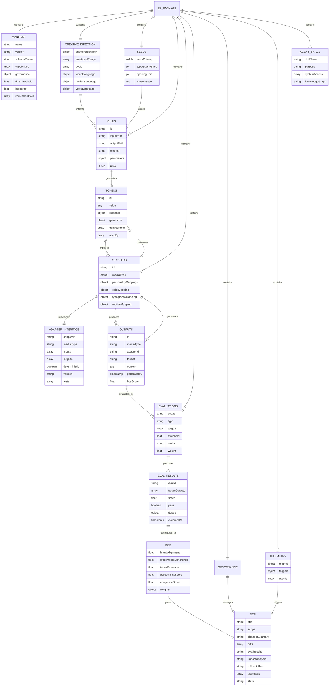
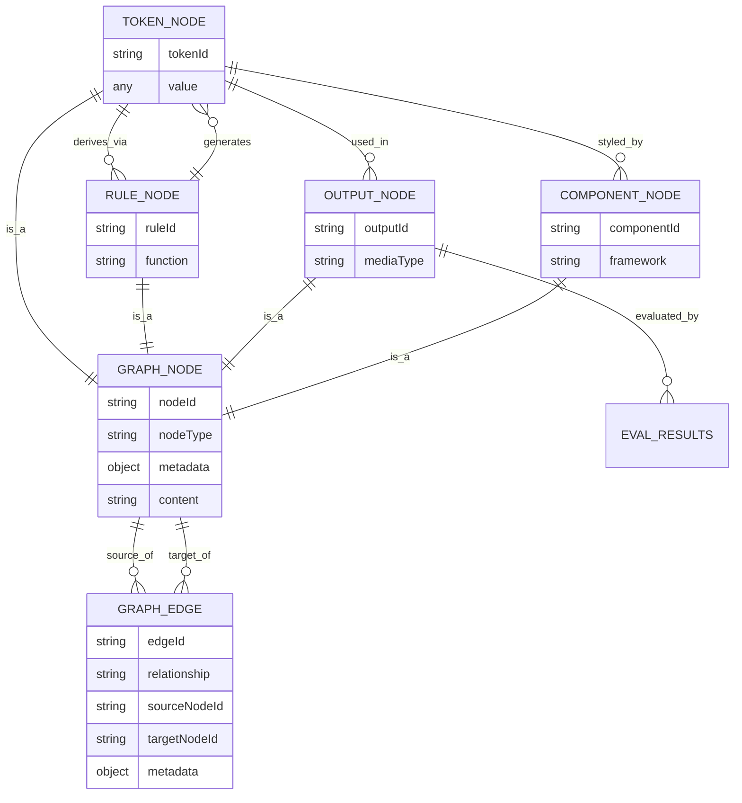
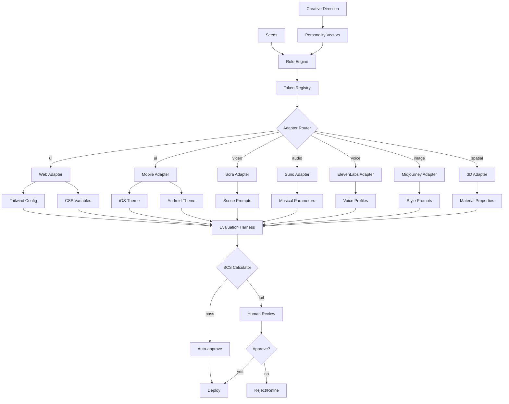
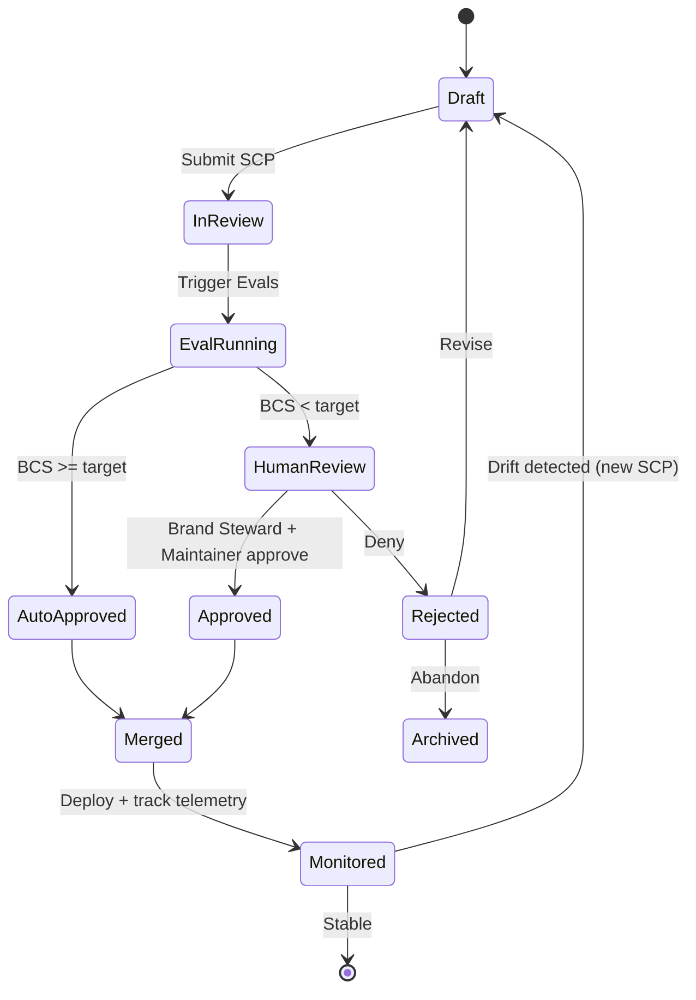
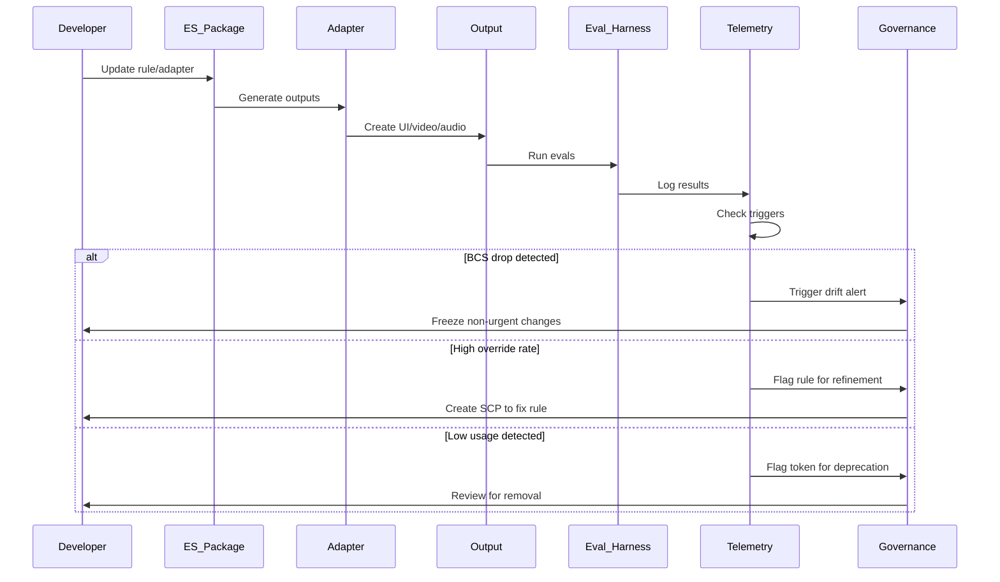
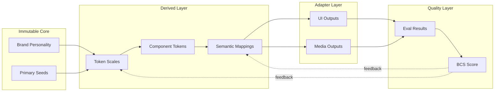

# Experience Systems: Entity Relationship Diagram

**Claude v3 — System Architecture ERD**

This diagram maps the core entities, relationships, and data flows within an Experience System package.

---

## Core System Architecture



---

## Knowledge Graph Layer



---

## Adapter Data Flow



---

## Governance State Machine



---

## Telemetry Event Flow



---

## Data Dependencies



---

## Package Structure as Tree

```
experience-system/
├── manifest.json                    [ES_PACKAGE.MANIFEST]
│
├── semantics/
│   ├── creative-direction.json      [CREATIVE_DIRECTION]
│   └── constraints.json             [avoid lists, guardrails]
│
├── seeds/
│   └── primitives.json              [SEEDS]
│
├── rules/
│   ├── color.js                     [RULES: palette generation]
│   ├── typography.js                [RULES: scale generation]
│   ├── motion.js                    [RULES: timing/easing]
│   └── cross-media.js               [RULES: personality mappings]
│
├── tokens/
│   └── registry.json                [TOKENS: generated artifacts]
│
├── adapters/
│   ├── web/
│   │   ├── adapter.json             [ADAPTER_INTERFACE]
│   │   └── tailwind.config.js       [OUTPUTS]
│   ├── mobile/
│   │   ├── ios-theme.json           [OUTPUTS]
│   │   └── android-theme.json       [OUTPUTS]
│   └── media/
│       ├── sora/
│       │   ├── adapter.json         [ADAPTER_INTERFACE]
│       │   └── prompts.json         [OUTPUTS]
│       ├── suno/
│       │   ├── adapter.json         [ADAPTER_INTERFACE]
│       │   └── parameters.json      [OUTPUTS]
│       ├── elevenlabs/
│       │   └── voice-profiles.json  [OUTPUTS]
│       └── midjourney/
│           └── style-params.json    [OUTPUTS]
│
├── evals/
│   ├── accessibility.test.js        [EVALUATIONS]
│   ├── brand-alignment.test.js      [EVALUATIONS]
│   ├── coherence.test.js            [EVALUATIONS]
│   └── config.json                  [BCS weights, thresholds]
│
├── governance/
│   ├── SCP-template.md              [SCP schema]
│   ├── proposals/
│   │   ├── SCP-001.md               [SCP instances]
│   │   └── SCP-002.md
│   └── approvers.json               [roles, permissions]
│
├── telemetry/
│   ├── instrumentation.json         [TELEMETRY config]
│   └── events/                      [logged events]
│
├── agents/
│   └── .claude/
│       ├── skills/                  [AGENT_SKILLS]
│       │   ├── token-query.md
│       │   └── brand-check.md
│       └── rules/
│           └── brand-compliance.md
│
└── docs/
    ├── knowledge-graph.json         [GRAPH_NODE, GRAPH_EDGE]
    └── README.md
```

---

## Key Relationships

### 1. Derivation Chain
`CREATIVE_DIRECTION + SEEDS → RULES → TOKENS → ADAPTERS → OUTPUTS`

### 2. Evaluation Loop
`OUTPUTS → EVALUATIONS → EVAL_RESULTS → BCS → GOVERNANCE → SCP`

### 3. Evolution Feedback
`TELEMETRY → triggers → SCP → approved changes → RULES/ADAPTERS → new OUTPUTS`

### 4. Knowledge Graph
`All entities (TOKENS, RULES, OUTPUTS, COMPONENTS) → GRAPH_NODES + GRAPH_EDGES → queryable by AGENT_SKILLS`

### 5. Governance Flow
`Change proposal → SCP (Draft) → Evals → BCS check → Approval → Merge → Monitor → Telemetry feedback`

---

## Entity Cardinalities

- **1 ES Package** : **1 Manifest**
- **1 ES Package** : **1 Creative Direction**
- **1 ES Package** : **1 Seeds**
- **1 ES Package** : **N Rules** (many rules)
- **1 Rule** : **N Tokens** (generates many tokens)
- **1 ES Package** : **N Adapters** (web, mobile, video, audio, voice, image, spatial)
- **1 Adapter** : **N Outputs** (multiple generated artifacts)
- **1 Output** : **N Eval Results** (tested by multiple evaluations)
- **N Eval Results** : **1 BCS** (composite score)
- **1 BCS** : **1 SCP** (gates approval)
- **1 ES Package** : **N SCPs** (change history)

---

## Notes

- **Immutable Core**: `brandPersonality` and primary `seeds` are protected and require highest governance approval
- **Deterministic Adapters**: All adapters must be deterministic (same inputs → same outputs) with snapshot tests
- **BCS as Quality Gate**: Brand Coherence Score (BCS) is the composite metric that determines auto-approval vs. human review
- **Telemetry as Evolution Engine**: Usage patterns, override rates, and drift detection drive continuous improvement via SCP workflow
- **Knowledge Graph as AI Interface**: All entities become graph nodes, enabling AI agents to query relationships and understand system lineage

---

**Document Version**: Claude v3-ERD
**Date**: 2025-11-22
**Purpose**: System architecture visualization for Experience Systems
**Related**: `codex-v2.md`, `gemini-v2.md`, `claude-v2.md`
